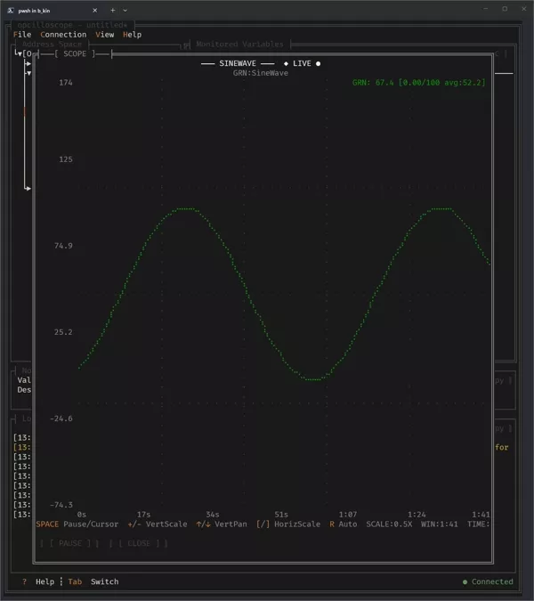
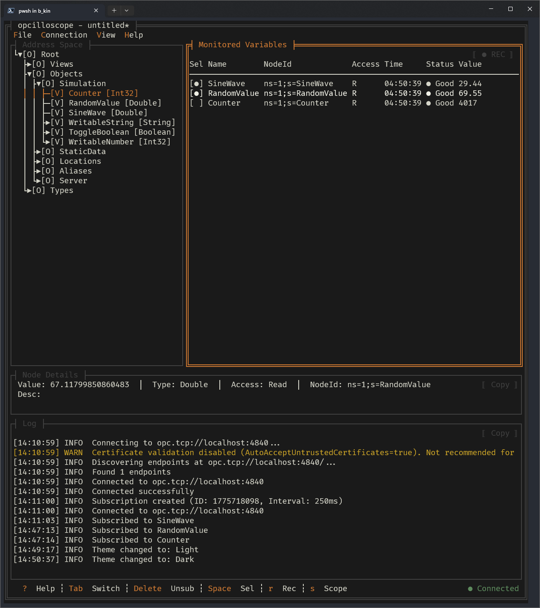
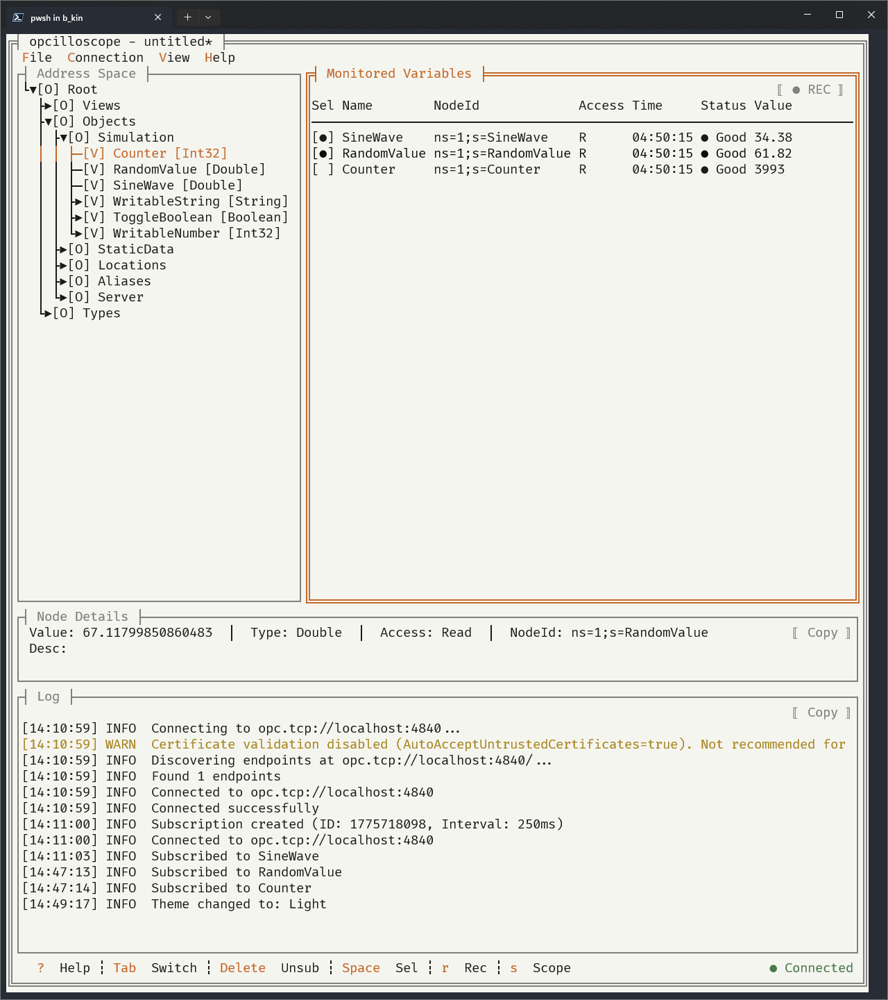

# opcilloscope

**A lightweight, cross-platform OPC UA client for the terminal heads.**

Browse, monitor, and subscribe to industrial automation data right from your terminal. Keyboard and mouse friendly. No bloated GUI, no complex setup, no license fees.

[](https://dotnet.microsoft.com/download/dotnet/10.0)
[](LICENSE)
[](https://github.com/gui-cs/Terminal.Gui)

<p align="center">
  <em>install → run → connect → browse → subscribe → select → scope in ~15 seconds</em>
</p>
<p align="center">
  
</p>
<p align="center">
  <em>a soothing sine wave</em>
</p>
<p align="center">
  
</p>

---

## Why opcilloscope?

Cause it was fun to build, but also...

| Traditional OPC Clients | opcilloscope |
|------------------------|--------------|
| Heavy desktop apps | Single portable binary, MIT licensed |
| Minutes to install | `curl | bash` and you're running |
| Resource-hungry GUIs | ~40MB RAM, runs anywhere |
| Windows-only | Windows, Linux, macOS (x64 & ARM) |
| Click-heavy workflows | Keyboard driven, mouse support |

### Use Cases

- **Commissioning**: Quickly verify PLC tags are publishing correctly
- **Troubleshooting**: Monitor live values during fault diagnosis
- **Integration Testing**: Validate OPC UA server configurations
- **Documentation**: Export snapshots for handover reports

---

## Features

- **Browse** — Lazily explore the OPC UA address space. Expand only what you need.
- **Monitor** — Subscribe to variables with `Enter`. Real-time updates via OPC UA subscriptions, not polling.
- **Inspect** — Full node attributes: Description, DataType, AccessLevel, ValueRank.
- **Scope** — Real-time multi-signal oscilloscope view (up to 5 signals).
- **Record** — Export monitored values to CSV for analysis or documentation.
- **Configure** — Save/load connection and subscription configs for recurring tasks.
- **Themes** — Dark and light themes to match your environment.

<p align="center">
  
  
</p>

---

## Install (User)

**Linux / macOS:**
```bash
curl -fsSL https://raw.githubusercontent.com/SquareWaveSystems/opcilloscope/main/install.sh | bash
```

**Windows (PowerShell):**
```powershell
irm https://raw.githubusercontent.com/SquareWaveSystems/opcilloscope/main/install.ps1 | iex
```

Or grab a binary from [GitHub Releases](https://github.com/SquareWaveSystems/opcilloscope/releases).

**Linux dependency:** The .NET runtime requires ICU libraries for globalization support. On Debian/Ubuntu, install them with:
```bash
sudo apt install libicu-dev
```
On Fedora/RHEL: `sudo dnf install libicu-devel`

Then to run:
```bash
opcilloscope
```

### Uninstall

**Linux / macOS:**
```bash
curl -fsSL https://raw.githubusercontent.com/SquareWaveSystems/opcilloscope/main/uninstall.sh | bash
```

Or manually:
```bash
rm ~/.local/bin/opcilloscope
rm -rf ~/.config/opcilloscope/       # optional: remove config files
rm -rf ~/.local/share/opcilloscope/  # optional: remove OPC UA certificates
```

**Windows (PowerShell):**
```powershell
irm https://raw.githubusercontent.com/SquareWaveSystems/opcilloscope/main/uninstall.ps1 | iex
```

Or manually:
```powershell
Remove-Item "$env:LOCALAPPDATA\Opcilloscope" -Recurse -Force   # binary
Remove-Item "$env:LOCALAPPDATA\opcilloscope" -Recurse -Force   # OPC UA certificates
Remove-Item "$env:APPDATA\opcilloscope" -Recurse -Force        # config files
```

If you installed to a custom directory (`OPCILLOSCOPE_INSTALL_DIR`), replace the paths above with your custom install location.

---

## Quickstart (Developer)

Requires [.NET 10 SDK](https://dotnet.microsoft.com/download/dotnet/10.0).

```bash
# Clone repo, cd, build
git clone https://github.com/SquareWaveSystems/opcilloscope.git
cd opcilloscope
dotnet build
dotnet run
```

Run tests:
```bash
dotnet test
```

---

## OPC UA Test Servers

**Built-in test server** (Counter, SineWave, RandomValue, writable nodes):
```bash
# Start the built-in test server
dotnet run --project Tests/Opcilloscope.TestServer
# Starts at opc.tcp://localhost:4840
```

**Public servers** (no setup required):

| Server | Endpoint URL |
|--------|--------------|
| OPC UA Server | `opc.tcp://opcuaserver.com:48010` |
| Eclipse Milo | `opc.tcp://milo.digitalpetri.com:62541/milo` |

**Docker** ([Microsoft OPC PLC](https://github.com/Azure-Samples/iot-edge-opc-plc)):
```bash
docker run -p 50000:50000 mcr.microsoft.com/iotedge/opc-plc:latest \
  --autoaccept --unsecuretransport
# Connect to opc.tcp://localhost:50000
```

---

## Contributing

Contributions welcome! Please submit an issue or a pull request.

---

## License

MIT License — use it however you want.

---

<p align="center">
  <strong>Built by <a href="https://squarewavesystems.com">Square Wave Systems</a></strong><br>
  Modern automation software
</p>

<p align="center">
  <em>Inspired by <a href="https://github.com/jesseduffield/lazygit">lazygit</a></em>
</p>
